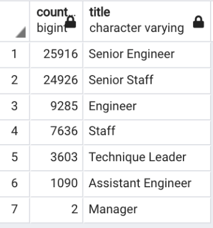
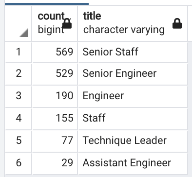
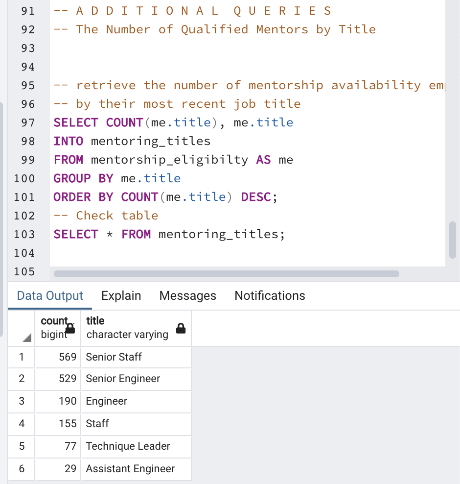

# Pewlett Analysis

## Purpose
The purpose of this analysis is to help the manager prepare for the upcoming "silver tsunami."

# Results: 

## Number of employees who are about to retire by job title

We know:

Total count of retiring employees = 72,458

Total count of employees = 300,024

- Almost a quarter of the current employees are about to retire.
- 50% of the employees about to retire are directly involved with engineering
- 2 out of 9 managers are retiring. A 22% loss of managerial staff should be a concern. Investing in internal training and/or recruiting external candidates for the managerial position will be necessary.

Mentorship program

- Only 1549 who were born in 1965 are retirement ready employees and are eligible to participate in a mentorship program. This only represents 2.1% of the total retiring employees are 
- The ratio is 1:46. Meaning there would be an average of one mentor for every 46 new hires.

One additional query we can use is to determine how many eligible mentorship employees are within each department

We can now determine the ratios between the mentor and how many hires he/she would have to train in order to fill all positions.

## Summary: 

- How many roles will need to be filled as the "silver tsunami" begins to make an impact?
    - PH will need to prepare to fill a total of 72,458 roles.

- Are there enough qualified, retirement-ready employees in the departments to mentor the next generation of Pewlett Hackard employees?

There are not enough mentors to prepare the next generation of PH employees.

See mentor / new hires ratios below:
- 1: 48 Senior Engineer
- 1: 43 Senior Staff
- 1: 48 Engineer
- 1: 49 Staff
- 1: 46 Technique Leader
- 1: 71 Assistant Engineer

### Additional Queries

